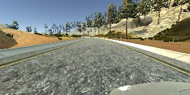
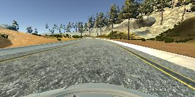
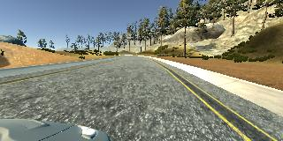

# Behaviorial Cloning Project

[](http://www.udacity.com/drive)

[//]: # (Image References)
[image1]: ./examples/NVIDIA_CNN.png "NVIDIA CNN Model Architecture" 
[image2]: ./examples/proc_shade.png "Processed Image to introduce difference in shade" 
[sample_c]: ./examples/sample_c.jpg "Center Image" 
[sample_l]: ./examples/sample_l.jpg "Left Image" 
[sample_r]: ./examples/sample_r.jpg "Right Image" 
[hist_all]: ./examples/hist_all.png "Histogram of Default Data Set" 
[hist_augmented]: ./examples/hist_augmented.png "Histogram of Final Training Set" 
[img_mse]: ./examples/mse.png "MSE of Training Epochs" 


Overview
---
This contains the discussion of my approach to the Behavioral Cloning Project.

In this project, I've learned about using deep neural networks and convolutional neural networks to clone driving behavior. Here, I trained, validated and tested models using Keras. The model's output is steering angle to an autonomous vehicle, based on images captured by the camera.

The provided simulator was used to train and test the model. You can steer a car around a track for data collection and the image data and steering angles were used to train a neural network. The model is integrated with the simulator so that the model can be used to drive the car autonomously around the track.

### Project Objectives
---

The goals / steps of this project are the following:
* Use the simulator to collect data of good driving behavior 
* Design, train and validate a model that predicts a steering angle from image data
* Use the model to drive the vehicle autonomously around the first track in the simulator. The vehicle should remain on the road for an entire loop around the track.


The Project
---

For the project, the following files are included in this repository: 
* [model.py](https://github.com/timotdsantos/CarND-Behavioral-Cloning-P3/blob/master/model.py)/[Behavioral_Cloning_Final.ipynb](https://github.com/timotdsantos/CarND-Behavioral-Cloning-P3/blob/master/Behavior_Cloning_Final.ipynb) contains the code to create and train the model. The file shows the pipeline I used for training and validating the model, and it contains comments to explain how the code works.
* [model.h5](https://github.com/timotdsantos/CarND-Behavioral-Cloning-P3/blob/master/model.h5) is the trained Keras model

* [video.mp4](https://github.com/timotdsantos/CarND-Behavioral-Cloning-P3/blob/master/video.mp4) is a video recording of the vehicle driving autonomously around the track for at least one full lap
* [README.md](https://github.com/timotdsantos/CarND-Behavioral-Cloning-P3/blob/master/README.md) file is the overall writeup and discussion describing the steps taken to accomplish the project goals
* [drive.py](https://github.com/timotdsantos/CarND-Behavioral-Cloning-P3/blob/master/drive.py) (script to drive the car)

    Using the Udacity provided simulator and my drive.py file, the car can be driven autonomously around the track by executing 
```sh
python drive.py model.h5
```


### Dependencies
This project requires:

* [CarND Term1 Starter Kit](https://github.com/udacity/CarND-Term1-Starter-Kit)

The enviroment can be created with CarND Term1 Starter Kit. Click [here](https://github.com/udacity/CarND-Term1-Starter-Kit/blob/master/README.md) for the details.

The simulator can be downloaded from the classroom. 


## Model Architecture and Training Strategy

### 1. An appropriate model architecture has been employed

I started with just a single fully-connected layer in order to setup the framework for the iterations. Multiple models were implemented starting from simple architectures that were covered in the course materials (single layer, lenet) to more complex ones(NVIDIA CNN). 

In selecting which model architecture to use, I iterated using 1-3 epochs of training and compared the validation loss, wherein NVIDIA CNN was one of the well performing models.I noticed that there's improvement on the validation accuracy and increased training time as the complexity increased. In the final submission, I used the NVIDIA CNN.


### 2. Attempts to reduce overfitting in the model

The ideal number of epochs for the selected model (NVIDIA-CNN) was 6 as evidenced by the lack of significant improvement of the validation and training mean-square-error for epochs 7 and above, anything above would have been overfitted. 

![alt text][img_mse]


The final litmus test of the trained model is by running the simulator in autonomous mode using the trained model.


### 3. Model parameter tuning

In terms of optimizing the model parameters, I used an adam optimizer so that manually training the learning rate wasn't necessary. 

```model.compile(loss='mse', optimizer='adam')```


The model was trained on 6 EPOCHS and with batch_size equal to 256.
 

### 4. Appropriate training data

The training data included in the udacity project repository was initially used. I collected other driving conditions like lane recovery combined with other data processing and data augmentation steps as discussed in the next section. 


## Model Architecture and Training Strategy

### 1. Solution Design Approach

The project involved an iterative design process that can be further broken down to the following sections:
- Data Collection
- Data Processing and Augmentation
- Model Development
- Training and Evaluation
- Simulation

The overall strategy for deriving the model architecture was to iterate through the process of trying out various model configuration, training data, and processing steps while analyzing the performance through validation and simulation.

#### Data Collection
Driving data around the track is collected, additional data is collected for various driving conditions.
#### Data Processing and Augmentation
The data collected was augmented or enhanced by performing image processing techniques on the training data so that the model can learn different conditions that may be present in actual/real-world settings without having to collect data with those real-world conditions.
#### Model Development
Various models were developed starting from basic ones(single layered, lenet) up to more complex convolutional networks (NVIDIA-CNN).
#### Training and evaluation
The collected data is split between training and validation sets. The model training and validation errors are calculated. This is the step where we decide whether to perform more tuning, or select a different architecture.
#### Simulation
Using the model that was trained and tuned to produce good validation performance metrics, the model is tested on Track 1 if the car can succesfuly drive around the track. This is the final litmus test for the model's performance, it also is useful to know what kind of additional training data needs to get collected.


### 2. Final Model Architecture

The model finally selected was patterned after the [NVIDIA architecture](http://images.nvidia.com/content/tegra/automotive/images/2016/solutions/pdf/end-to-end-dl-using-px.pdf). 

![alt text][image1]

The selection of the NVIDIA CNN was because the architecture had a good balance of complexity (not too complex network, doesn't take too long to train) and performance (performs well comopared with the other architecture). The decision to choose NVIDIA CNN was also guided by the fact that the architecture was particularly designed to do the task at hand and has undergone experimental evaluation to identify the optimal layer configurations.

At the beginning, there's a normalization layer which scales the pixel values to the range -0.5 and 0.5.


```model.add(Lambda(lambda x: (x / 255.0) - 0.5, input_shape=(160,320,3)))```


The five convolutional layers were designed to perform feature extraction as described in the NVIDIA paper. 

```
model.add(Convolution2D(24, 5, 5, activation = 'relu', subsample=(2, 2) ))
model.add(Convolution2D(36, 5, 5, activation = 'relu', subsample=(2, 2) ))
model.add(Convolution2D(48, 5, 5, activation = 'relu', subsample=(2, 2) ))
model.add(Convolution2D(64, 3, 3, activation = 'relu' ))
model.add(Convolution2D(64, 3, 3))
```

The three fully-connected layers are meant to finally control the steering angle.

```
model.add(Flatten())
model.add(Dense(1162))
model.add(Dense(100))
model.add(Dense(50))
model.add(Dense(10))
model.add(Dense(1))
```

### 3. Creation of the Training Set & Training Process

### Data Collection 

#### Default Data set
The data initially used was the one included in the project repository. In the initial iterations of the development, the included data was sufficient to be able to drive the car in the parts of the track with minimal curves.

Initially, there were around 8000+ images used, using only the 'center' camera of the car.

The histogram of the steering angles is shown here:

![alt_text][hist_all]

The amount of neutral steering angle (0) will bias training the model, hence, the need to undersample the neutral angles or augment the less-represented angles.

#### Recovery Data Set
Observing the behavior of the initial models, the car seemed to not be able to get back to the middle of the road when near the edge. To solve this, I recorded multiple occasions where the car is controlled to go back to the middle of the lane.

### Data Processing and Augmentation

#### Multiple-camera
The default data set and the simulator output contains three cameras (left, right, center). To be able to use the left and right cameras, the current steering angle is biased by +0.25 for left camera image or -0.25 for right camera image.
<p align="center">
  
</p>

Adding 0.25 on the left image causes the car to have a steering angle adjust to the right, while subtracting 0.25 on the right image causes the car to move to the left.

#### Additional Data from Simulator
Another approach to add more data was to flip the images and multiply the corresponding steering angle by -1. The images where the steering angle is zero were not all selected and/or flipped.


#### Additional Processing
To be able to handle various lighting conditions, random shading were applied on the training data. 

![alt text][image2]

Part of the image includes the bumper of the car and the sky. Additional cropping using the function Cropping2D was used to retain the region of interest to within the road. 
* 70 pixels from the top (the sky)
* 25 pixels from the bottom (car)


#### Final Training Data Set
After the collection and augmentation, I had 34000+ number of data points. I finally randomly shuffled the data set and put 80%(12857) on the training set, and 20%(3215) of the data into a validation set.

I used this data for training the model. The validation set was used to determine if the model was overfitting or underfitting. 

After all the data augmentation and sampling, this is the histogram of the final training data:

![alt_text][hist_augmented]


#### Simulation video

It's been noted the simulator might perform differently based on the hardware. The simulation of the car running around the track using the trained model comes with this repository and could be accessed [here](https://github.com/timotdsantos/CarND-Behavioral-Cloning-P3/blob/master/video.mp4).

[](https://github.com/timotdsantos/CarND-Behavioral-Cloning-P3/blob/master/video.mp4)

